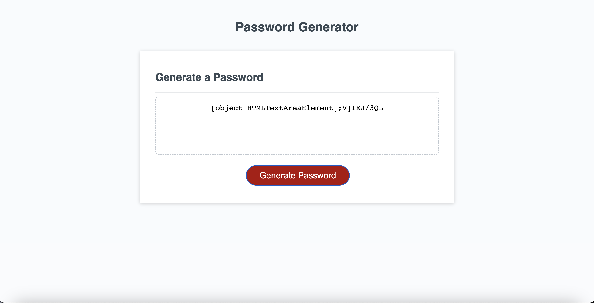

# password-generator

## Description 

This website's main function is to generate a random password based on the prompts indicated. The user will have the option to include lowercase, uppercase, numbers, and special characters within the password generated based on the length asked by the prompt. The generated password will then display on the screen when successful. Although it being a password generator site, this website can be used to generate randomized characters of a given length for other potential uses. 

## Badges

NA

## Visuals

## Installation

NA 
## Usage

Provides a semi-automatic process of generating a password of certain characters given a specific length. There is yet no other further use of this site.

## Roadmap

Implementation of javascript to link other webs via POST or GET.
Add more flair via html/css to be more visually appealing.
Replace the "[object HTMLTextAreaElement]" with "[ password ]"

## Contributing

Not currently open to contributions at this time.

## Authors and acknowledgement

Justin Dong
## License

NA

## Resources

[Github Repository](https://github.com/dong135790/password-generator)
[Deployed Site](https://dong135790.github.io/password-generator/)

## Project Status

Complete